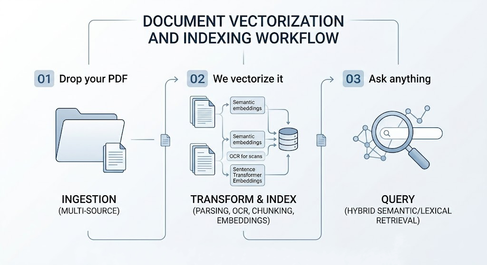
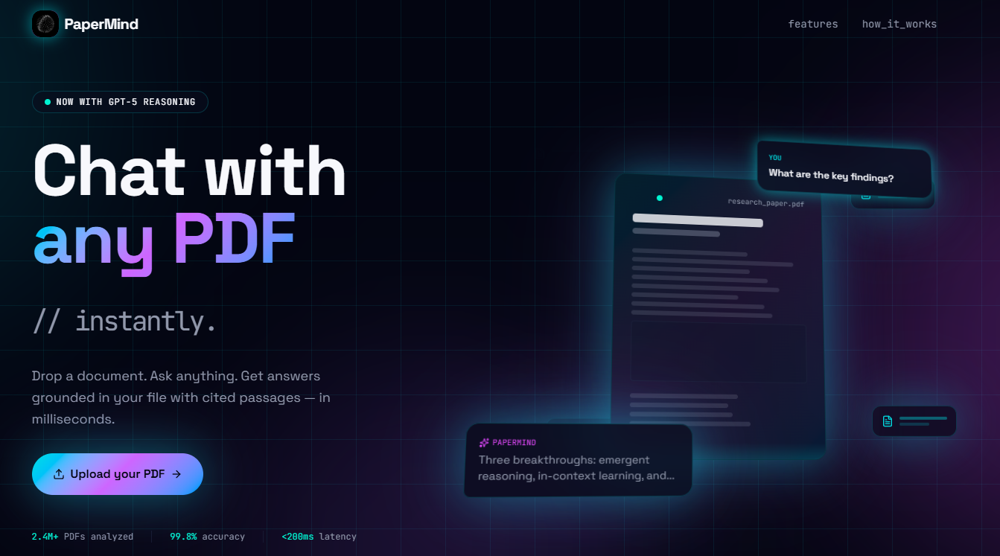

# PaperMind

**Minimalist RAG Pipeline**  
A frictionless, production-ready Retrieval-Augmented Generation (RAG) system for ingesting complex documents and delivering precise, source-grounded answers.

---

## ⚡ Architecture Workflow

### 1. Ingestion — Data Pipeline
- Handles massive documents (2,000+ pages)
- Drag-and-drop binaries, URL ingestion, or cloud sync (e.g., Drive APIs)

### 2. Vectorization — Embedding & Indexing
- Structure-aware chunking (headers, tables, footnotes)
- OCR + vision support for scanned PDFs and diagrams
- High-dimensional embeddings stored in local or cloud vector databases

### 3. Synthesis — Retrieval & Inference
- Hybrid search (dense semantic + keyword/BM25)
- Deterministic context injection with cross-references
- Outputs: summaries, extractions, translations, and comparisons with verifiable citations

---

